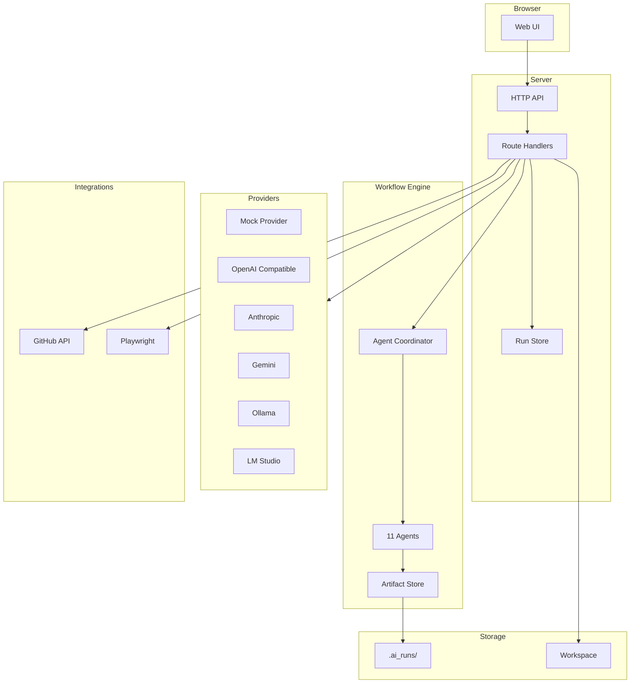
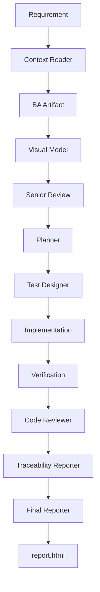
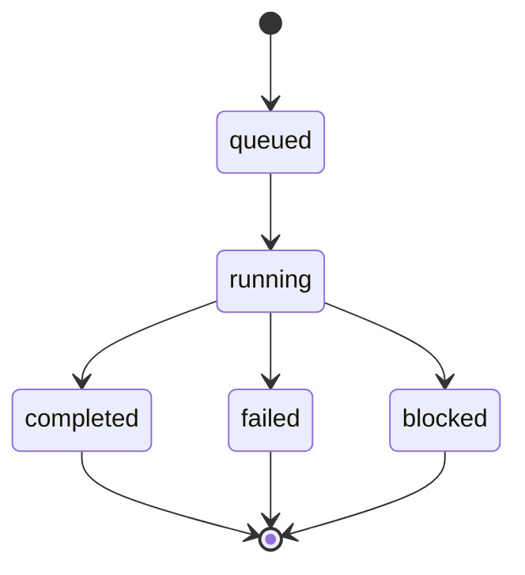
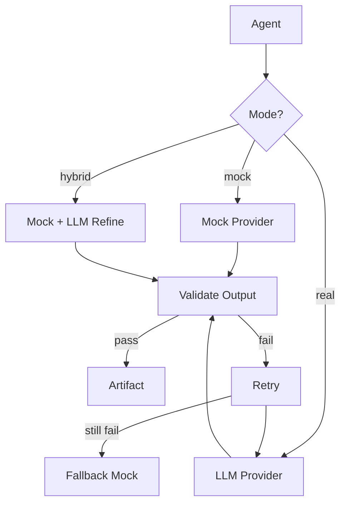

# Final Architecture

## System Architecture

```mermaid
graph TB
    subgraph Browser
        UI[Web UI]
    end

    subgraph Server
        API[HTTP API]
        RunStore[Run Store]
        Routes[Route Handlers]
    end

    subgraph Workflow Engine
        Orchestrator[Agent Coordinator]
        Agents[11 Agents]
        ArtifactStore[Artifact Store]
    end

    subgraph Providers
        MockProvider[Mock Provider]
        OpenAI[OpenAI Compatible]
        Anthropic[Anthropic]
        Gemini[Gemini]
        Ollama[Ollama]
        LMStudio[LM Studio]
    end

    subgraph Storage
        AIRuns[.ai_runs/]
        Workspace[Workspace]
    end

    subgraph Integrations
        GitHub[GitHub API]
        Playwright[Playwright]
    end

    UI --> API
    API --> Routes
    Routes --> RunStore
    Routes --> Orchestrator
    Orchestrator --> Agents
    Agents --> ArtifactStore
    ArtifactStore --> AIRuns
    Routes --> Providers
    Routes --> GitHub
    Routes --> Playwright
    Routes --> Workspace
```

## Agent Workflow

```mermaid
flowchart TD
    R[Requirement] --> CR[Context Reader]
    CR --> BA[BA Artifact]
    BA --> VM[Visual Model]
    VM --> SR[Senior Review]
    SR --> PL[Planner]
    PL --> TD[Test Designer]
    TD --> IM[Implementation]
    IM --> VR[Verification]
    VR --> CR2[Code Reviewer]
    CR2 --> TR[Traceability Reporter]
    TR --> FR[Final Reporter]
    FR --> Report[report.html]
```

## Run Lifecycle

```mermaid
stateDiagram-v2
    [*] --> queued
    queued --> running
    running --> completed
    running --> failed
    running --> blocked
    completed --> [*]
    failed --> [*]
    blocked --> [*]
```

## Artifact Generation Flow

```mermaid
flowchart LR
    REQ[Requirement] --> CP[Context Pack]
    CP --> BA[BA Package]
    BA --> VM[Visual Model]
    VM --> SR[Senior Review]
    SR --> TP[Task Plan]
    TP --> TST[Test Plan]
    TST --> IM[Implementation]
    IM --> VR[Verification]
    VR --> CR[Code Review]
    CR --> TR[Traceability]
    TR --> FR[Final Report]
    FR --> HTML[report.html]
```

## Model Provider Flow

```mermaid
flowchart TD
    A[Agent] --> M{Mode?}
    M -->|mock| Mock[Mock Provider]
    M -->|real| LLM[LLM Provider]
    M -->|hybrid| Both[Mock + LLM Refine]
    Mock --> V[Validate Output]
    LLM --> V
    Both --> V
    V -->|pass| OK[Artifact]
    V -->|fail| R[Retry]
    R --> LLM
    R -->|still fail| F[Fallback Mock]
```
